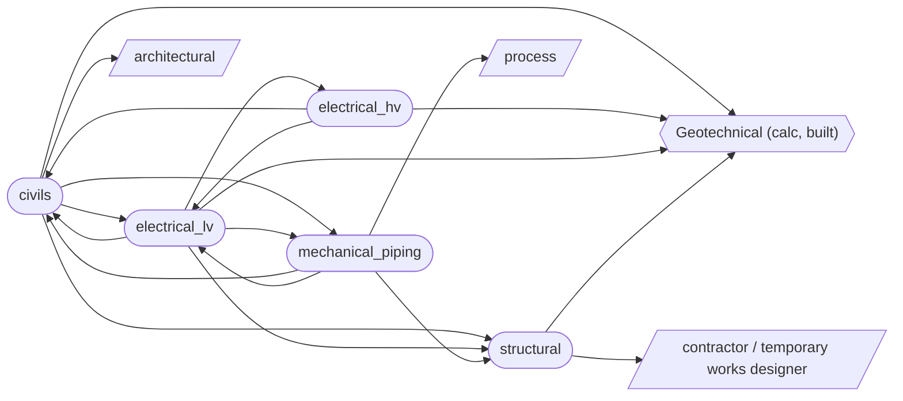

# Project Basis of Design — Combined

One project-level view across all five disciplines: how they depend on each other, what's still an open input, and each discipline's own basis of design in full.

## Process flow — discipline dependency order

Derived directly from the `Interface` entries already declared in each discipline's basis of design (see `integration/graph.py`) — not a separately asserted opinion about sequencing.

**Geotechnical** (the one built calc module) is the one true starting point — civils, structural, and both electrical disciplines all depend on it (ground model, bearing resistance, soil resistivity), and nothing depends back on it.

**Structural** depends only on geotechnical (plus an external contractor for temporary works) and nothing loops back into it from the graph — it can be sequenced right after geotechnical and developed largely independently from there.

**civils, electrical_hv, electrical_lv, mechanical_piping** mutually depend on each other — each one's basis of design references at least one of the others, and following the edges far enough loops back to the start. This is not a strict pipeline: these four disciplines need iterative/concurrent co-design. Use `integration.process_state` to see what's actually unblocked at any point rather than assuming a fixed hand-off order between them.

## Open items / RFI register

53 pending inputs found across all five disciplines' criteria and assumptions (e.g. "to be confirmed from the DNO connection offer") — see `integration/open_items.py`. Full register:

*53 open items across all disciplines.*

### civils (14)

- **Earthworks and ground remediation** [criterion]: Permanent slope angle: to be confirmed from ground model — Set per BS 6031 once characteristic ground parameters are available from calcs/geotechnical/.
- **Foul drainage** [assumption]: Foul flow rates are based on occupancy/use rates per BS EN 752 / Sewers for Adoption guidance, to be confirmed once an occupancy schedule is available.
- **Foul drainage** [assumption]: Connection to the existing public foul sewer is assumed available at adequate capacity — to be confirmed by a sewer capacity check/pre-development enquiry with the water company.
- **Surface water drainage / SuDS** [criterion]: Climate change allowance: to be confirmed against current EA guidance — These published allowances are updated periodically — do not hard-code a percentage without checking the current figure.
- **Surface water drainage / SuDS** [assumption]: Infiltration testing (BRE Digest 365 falling-head test) is assumed required to confirm SuDS feasibility, pending the ground model.
- **Surface water drainage / SuDS** [assumption]: Existing surface water sewer/watercourse is assumed to have available capacity for any residual controlled discharge, pending confirmation.
- **Flood risk** [criterion]: Flood zone classification: to be confirmed from the current EA flood map — Drives whether a full FRA and sequential/exception test are required at all.
- **Flood risk** [assumption]: The site is provisionally assumed Flood Zone 1 (low probability) pending confirmation from the current EA flood map for planning.
- **Highways and access** [criterion]: Design vehicle for swept path: to be confirmed (e.g. articulated HGV, fire tender) — Governs junction/access geometry — set once the site's servicing/emergency access requirements are known.
- **External works and pavements** [criterion]: Design traffic loading: to be confirmed — Set from the actual traffic/servicing regime for the site, per DMRB CD 226.
- **External works and pavements** [assumption]: Subgrade CBR value is assumed from the geotechnical ground model, pending confirmation by in-situ/laboratory CBR testing.
- **Utilities coordination** [criterion]: Minimum service clearance (crossing): to be confirmed per NJUG/street works guidance — Depends on the specific pair of services crossing — no single figure applies across all combinations.
- **Retaining structures** [criterion]: Surcharge loading allowance: to be confirmed — Set from actual adjacent loading (traffic, storage, plant) once the layout is known — do not assume a nominal figure without checking.
- **Retaining structures** [assumption]: Retaining wall type (e.g. gravity, embedded cantilever, propped) is assumed to be determined by height and space constraints, to be confirmed once the layout is finalised.

### structural (4)

- **Substructure and foundations** [criterion]: Minimum founding depth: to be confirmed from ground model — Set from calcs/geotechnical/ characteristic parameters and frost depth once the ground model exists for the site.
- **Substructure and foundations** [criterion]: Base plate bearing pressure limit: to be confirmed — Governed by the concrete/grout bearing capacity beneath the base plate, not the steel design itself.
- **Primary steel frame** [criterion]: Wind loading basis: to be confirmed from BS EN 1991-1-4 site parameters — Standard UK inland site assumed as a default; coastal/exposed/high-altitude sites require a site-specific wind assessment.
- **Temporary works** [criterion]: Permissible unbraced erection stage duration: to be confirmed by contractor — Not a fixed design value — the erection contractor sets this once the erection method statement is developed, informed by the performance requirements in this section.

### electrical_lv (11)

- **Design standards and general criteria** [criterion]: Earthing system: TN-S (provisional) — Typical industrial arrangement fed from a dedicated transformer — the actual system depends on the HV/LV earthing decision made in basis_of_design/electrical_hv.py; confirm once that's settled.
- **Design standards and general criteria** [assumption]: A TN-S earthing system is assumed as the default industrial arrangement, pending confirmation of the combined-vs-separate HV/LV earthing decision (see basis_of_design/electrical_hv.py).
- **Earthing and bonding** [criterion]: Minimum main bonding conductor size: per BS 7671 Table 54.8 — Sized from the supply neutral/earthing conductor cross-sectional area — confirm once the incoming supply arrangement is fixed.
- **Earthing and bonding** [assumption]: Soil resistivity is assumed from calcs/geotechnical/ characteristic values pending confirmation by a direct resistivity test at the earth electrode location(s).
- **Motor control and LV switchgear** [assumption]: Motor loads and quantities are assumed to be confirmed once the mechanical piping discipline's pump/equipment schedule exists — this section cannot finalise MCC sizing independently of that input.
- **Lighting** [assumption]: A standard maintained emergency lighting scheme is assumed (rather than non-maintained/stand-by escape lighting only), pending the site-specific emergency lighting risk assessment.
- **Small power and containment** [assumption]: Cable containment routes are assumed coordinated with mechanical piping and structural steelwork to avoid clashes, pending a 3D model coordination review once all disciplines have routed their services.
- **Hazardous area classification** [criterion]: Equipment protection level (EPL) required: to be confirmed per zone — Set from the zone classification once established — e.g. Ga/Gb/Gc for gas zones.
- **Arc flash and electrical safety** [criterion]: Arc flash study trigger: all boards/MCCs above a minimum prospective fault level (to be confirmed) — Threshold below which an arc flash study is not considered necessary — set per the project's electrical safety policy/client standard.
- **Arc flash and electrical safety** [criterion]: PPE category framework: to be confirmed — IEEE 1584/NFPA 70E or an equivalent UK-recognised method — Sets incident energy bands and corresponding PPE categories once the arc flash study is complete.
- **Arc flash and electrical safety** [assumption]: An arc flash study is assumed required for the main LV switchboard and all MCCs above a minimum fault level threshold, to be confirmed against the project's electrical safety policy.

### electrical_hv (14)

- **Design standards and general criteria** [criterion]: System fault level: to be confirmed from the DNO connection offer/fault level statement — Not calculated independently — obtained from the network operator, since it depends on their upstream network configuration.
- **Design standards and general criteria** [criterion]: Insulation level (BIL): per BS EN 60071, dependent on voltage class — Basic impulse insulation level — set once the HV voltage class is confirmed for the project.
- **Design standards and general criteria** [assumption]: The specific HV voltage class is assumed to be confirmed per project rather than fixed by this basis of design, per the generic-across-voltage-classes scope decision.
- **HV incoming supply and connection** [criterion]: Connection point: to be confirmed via DNO connection application — Set by the DNO's connection offer once submitted — not a value this basis of design can set independently.
- **Substations and switchgear** [criterion]: Switchgear topology: ring main unit (RMU), single incoming supply (provisional) — Typical for a single HV connection — confirm ring/radial topology against the site's actual reliability/redundancy requirement.
- **Substations and switchgear** [criterion]: Substation ingress protection: to be confirmed (indoor building vs. outdoor enclosure) — Set once the substation location/type is fixed with civils/structural.
- **Substations and switchgear** [assumption]: Substation location and space allowance are assumed to be coordinated with civils and structural, pending a confirmed site layout.
- **Transformers** [criterion]: Transformer rating: to be confirmed from the LV load schedule plus diversity — Cannot be finalised independently of basis_of_design/electrical_lv.py's load schedule and diversity assumptions.
- **HV cabling and cable management** [criterion]: Cable insulation/conductor: XLPE insulated, copper or aluminium conductor (to be confirmed) — Conductor material is typically a cost/weight trade-off decision — confirm project preference.
- **HV cabling and cable management** [assumption]: Cable route length/topology is assumed to be coordinated with civils utilities coordination and structural cable management, pending a routing study once the site layout is confirmed.
- **HV earthing and touch/step potential** [criterion]: Touch/step potential limits: per BS EN 50522, based on fault clearance time and body resistance model — No single project-wide figure — calculated from the specific fault clearance time and earthing arrangement once the protection study is complete.
- **HV earthing and touch/step potential** [criterion]: Substation earth resistance target: to be confirmed from soil resistivity survey and earth grid design — Cannot be set without a site-specific soil resistivity survey — see assumptions.
- **Arc flash and HV safety** [criterion]: HV arc flash calculation method: to be confirmed — IEEE 1584 or an equivalent HV-specific method — Confirm which method/tool is used for the incident energy calculation; not all LV-oriented tools extend cleanly to HV switchgear.
- **Arc flash and HV safety** [criterion]: Minimum PPE category for HV switching: to be confirmed from the study — Typically a higher category than the equivalent LV assessment — set once the HV-specific study is complete.

### mechanical_piping (10)

- **Design standards and general criteria** [criterion]: Design pressure: to be confirmed from process data — Set per line from the process design conditions, not a single project-wide figure.
- **Design standards and general criteria** [criterion]: Design temperature: to be confirmed from process data — Set per line from the process design conditions; also drives the minimum design metal temperature (MDMT) check in material_selection_and_corrosion.
- **Design standards and general criteria** [criterion]: Piping class/category: to be confirmed per line (PED Article 13 category / ASME B31.3 fluid service category) — Governs the applicable testing/inspection rigour — kept generic pending the specific process fluid and pressure/volume data per line.
- **Design standards and general criteria** [assumption]: The governing piping code (ASME B31.3 vs. BS EN 13480) is assumed to be confirmed per project/client, consistent with the deliberate decision to keep this generic rather than fix one.
- **Pipe sizing and flow** [criterion]: Maximum allowable pressure drop: to be confirmed per line — Typically constrained by downstream equipment NPSH/control valve authority — set per line, not a single figure.
- **Material selection and corrosion** [criterion]: Minimum design metal temperature (MDMT): to be confirmed — Governs whether impact testing is required per ASME B31.3/BS EN 13480 — set from the lowest expected metal temperature (ambient or process, whichever governs).
- **Pressure testing and inspection** [criterion]: NDT extent: to be confirmed per line class/category — Ranges from spot-check (normal fluid service) to 100% (Category M/severe cyclic service) — set per line once its category is confirmed.
- **Insulation and heat tracing** [criterion]: Heat tracing maintain temperature: to be confirmed per fluid — Set from the specific fluid's freeze point/pour point or viscosity requirement — no single project-wide figure.
- **Supports, structural interface, and hazardous area interface** [criterion]: Coordination review trigger: at each major design stage (to be confirmed per project programme) — Sets how often piping/structural/electrical interface coordination is formally reviewed — confirm against the project's design review schedule.
- **Supports, structural interface, and hazardous area interface** [assumption]: Pipe support loads are assumed final only once the stress analysis (pipe_stress_analysis_and_supports) is complete — iterative coordination with the structural discipline is expected before that point, not a single one-off handover.

## Civils — full basis of design

# Civils — Basis of Design

## Site and existing conditions

Topographic survey, existing levels, boundaries, and existing utility records — the baseline all other civils elements are measured against.

**Design criteria:**

- Survey vertical accuracy: ±10 mm — Typical topographic survey tolerance — confirm against the project survey brief.
- Survey horizontal accuracy: ±20 mm
- Survey datum: Ordnance Survey Newlyn Datum (OSGB36) — Confirm project datum — some sites use a local site grid instead.
- Utility survey quality level: PAS 128 Quality Level B/A — Target verification level for buried service records before detailed design proceeds.

**Assumptions:**

- Existing statutory undertaker utility records are indicative only until verified by trial holes/GPR survey (PAS 128).
- No presumption of undiscovered services is made until a PAS 128 survey is complete.

**Exclusions:**

- Detailed measured building survey of existing structures — assumed covered by the architectural/structural survey scope.

**Interfaces:**

- **geotechnical**: Existing ground levels needed to establish founding depths and overburden.
- **architectural**: Existing levels constrain finished floor levels and external works design.

**Deliverables:**

- Topographic survey drawing (drawing)
- Existing utility record drawing (drawing) — Composite of all statutory undertaker records obtained.
- Site boundary / red line plan (drawing)

## Earthworks and ground remediation

Cut/fill balance, temporary and permanent slope stability, and any ground remediation strategy.

**Applicable standards:**

- BS 6031 — Code of practice for earthworks
- BS EN 1997-1 (UK NA) _Shared with the geotechnical module — slope stability and retaining checks._
- CIRIA C552 _Contaminated land risk assessment / remediation guidance — confirm current CIRIA reference._

**Design criteria:**

- Permanent slope angle: to be confirmed from ground model — Set per BS 6031 once characteristic ground parameters are available from calcs/geotechnical/.
- Cut/fill tolerance: ±0 m³ — Target a balanced cut/fill unless import/export is explicitly agreed — reduces haulage cost/risk.
- Contamination screening trigger: Phase 1 desk study — Threshold for commissioning a Phase 2 intrusive investigation, per CLR11-style guidance.

**Assumptions:**

- Site-won material is assumed suitable for reuse as engineered fill, subject to geotechnical testing confirming it.
- No contamination is assumed present unless a Phase 1 desk study identifies a plausible source-pathway-receptor linkage.

**Risk flags:**

- **[HIGH] [temporary_works]** Temporary excavation slopes and any temporary retaining/support during earthworks are a separate design case from the permanent condition — the permanent cut/fill and slope stability design does not itself validate that the construction-stage excavation is safe. (trigger: Any earthworks section by nature involves a temporary excavated condition before the permanent profile/remediation is complete.) — recommended action: Temporary works designer/contractor to assess temporary slope stability per BS 6031 against actual ground conditions and construction sequence.

**Exclusions:**

- Detailed remediation design/validation (specialist remediation contractor scope) — this section covers strategy only, not detailed remediation engineering.

**Interfaces:**

- **geotechnical**: Ground model (strata, water table) drives cut/fill and slope stability checks — see calcs/geotechnical/.
- **structural**: Remediation strategy may affect founding levels/type.

**Calculations required:**

- Cut/fill balance: Earthwork volumes across the site. (not yet built)
- Slope stability check — to BS EN 1997-1 (not yet built)

**Deliverables:**

- Earthworks specification (specification)
- Cut/fill volume schedule (schedule)
- Remediation strategy report (report) — Only where contamination risk is identified.

## Foul drainage

Foul water strategy, pipe sizing/capacity, and adoption standards.

**Applicable standards:**

- Sewers for Adoption _Confirm current edition — 7th/8th ed. depending on the servicing water company._
- BS EN 752 — Drain and sewer systems outside buildings
- Building Regulations Part H _England & Wales — confirm applicability by jurisdiction._

**Design criteria:**

- Minimum self-cleansing velocity: 0.75 m/s — Typical Sewers for Adoption / Building Regs criterion at design flow.
- Minimum cover depth (adoptable): 1.2 m — Typical under highway — confirm against the specific water company's design/construction guidance.
- Minimum pipe gradient: 1:80 (150mm dia.) — Illustrative — actual minimum gradient is diameter-dependent per the governing standard.

**Assumptions:**

- Foul flow rates are based on occupancy/use rates per BS EN 752 / Sewers for Adoption guidance, to be confirmed once an occupancy schedule is available.
- Connection to the existing public foul sewer is assumed available at adequate capacity — to be confirmed by a sewer capacity check/pre-development enquiry with the water company.

**Exclusions:**

- Trade effluent pre-treatment design — specialist scope, only required if a trade effluent consent is triggered.

**Calculations required:**

- Foul flow calculation: Peak foul flow from occupancy/use, pipe sizing. (not yet built)

**Deliverables:**

- Foul drainage layout drawing (drawing)
- Foul drainage calculation report (calculation report)
- Sewer adoption submission pack (report) — Only where the network is to be offered for adoption (S104 or equivalent).

## Surface water drainage / SuDS

Attenuation sizing, discharge rate limits, climate change allowances, and SuDS/adoption standards — typically the largest civils calculation deliverable.

**Applicable standards:**

- CIRIA C753 — The SuDS Manual
- Non-statutory technical standards for SuDS _Defra — confirm current status/supersession._
- Sewers for Adoption _Confirm current edition._
- BS EN 752

**Design criteria:**

- Discharge rate: Greenfield QBAR (or local authority/LLFA-specified rate) — Confirm the governing rate with the Lead Local Flood Authority — some set a fixed litres/second/hectare cap instead.
- Climate change allowance: to be confirmed against current EA guidance — These published allowances are updated periodically — do not hard-code a percentage without checking the current figure.
- Design storm return period (attenuation): 1 in 100 year + climate change — With a 1 in 30 year check for surcharge-free performance, per common SuDS practice.
- SuDS management train priority: Infiltration > attenuation/detention > controlled discharge — Per the CIRIA C753 SuDS hierarchy — confirm feasibility of each tier before committing to the next.

**Assumptions:**

- Infiltration testing (BRE Digest 365 falling-head test) is assumed required to confirm SuDS feasibility, pending the ground model.
- Existing surface water sewer/watercourse is assumed to have available capacity for any residual controlled discharge, pending confirmation.

**Exclusions:**

- Long-term SuDS maintenance/adoption legal agreement drafting — a legal, not engineering, deliverable (the maintenance schedule itself is still produced, see deliverables).

**Interfaces:**

- **geotechnical**: Infiltration rate / ground conditions determine SuDS feasibility (soakaways etc.).
- **flood_risk**: Discharge rate and climate change allowance are usually set by the FRA.

**Calculations required:**

- Attenuation volume sizing: Storage required to limit discharge to the agreed rate. (not yet built)
- Discharge rate calculation: Greenfield/brownfield runoff rate per the governing standard. (not yet built)

**Deliverables:**

- Drainage strategy report (report)
- Attenuation sizing calculation (calculation report)
- SuDS maintenance schedule (schedule)

## Flood risk

Flood Risk Assessment (FRA) requirements, finished floor levels, and climate change allowances.

**Applicable standards:**

- NPPF — National Planning Policy Framework _Flood risk sequential/exception test provisions._
- EA climate change allowances guidance _Confirm current published allowances at time of use — these are updated periodically._

**Design criteria:**

- Finished floor level freeboard: 300 mm — Typical minimum above the design flood level (1 in 100 year + climate change) — confirm against the LLFA/EA's specific requirement for the site.
- Flood zone classification: to be confirmed from the current EA flood map — Drives whether a full FRA and sequential/exception test are required at all.

**Assumptions:**

- The site is provisionally assumed Flood Zone 1 (low probability) pending confirmation from the current EA flood map for planning.

**Exclusions:**

- Detailed hydraulic/hydrological modelling of adjacent watercourses — specialist flood consultant scope, only required if the site interacts directly with a modelled watercourse.

**Interfaces:**

- **architectural**: Finished floor levels are typically set from FRA outputs.
- **surface_water_drainage_suds**: Climate change allowance and discharge rate constraints flow into SuDS sizing.

**Deliverables:**

- Flood Risk Assessment report (report)
- Finished floor level drawing (drawing)

## Highways and access

Site access geometry, visibility splays, junction design, and adoption standards for any new/altered highway.

**Applicable standards:**

- Manual for Streets _MfS / MfS2 — confirm which applies by road classification/authority._
- DMRB — Design Manual for Roads and Bridges _Where the interface is with a trunk road/strategic network._

**Design criteria:**

- Visibility splay (x-distance): 2.4 m — Typical stopping-sight-distance x-dimension per Manual for Streets — y-distance depends on design speed and must be set per site.
- Design vehicle for swept path: to be confirmed (e.g. articulated HGV, fire tender) — Governs junction/access geometry — set once the site's servicing/emergency access requirements are known.

**Assumptions:**

- Access design assumes the current posted speed limit/classification of the adjoining highway applies, unless a Stage 1 Road Safety Audit indicates otherwise.

**Exclusions:**

- Traffic impact assessment / transport statement — specialist transport planner scope, not produced by this civils BoD.

**Deliverables:**

- Access/junction general arrangement drawing (drawing)
- Swept path analysis drawings (drawing)
- Visibility splay drawing (drawing)

## External works and pavements

Hard and soft landscaping, and pavement design/loading for roads, parking, and hardstanding.

**Applicable standards:**

- Manual of Contract Documents for Highway Works (MCHW) _For adoptable road pavement specification._
- DMRB CD 226 _Pavement design — confirm current designation, this series is renumbered periodically._

**Design criteria:**

- Pavement design life: 40 years — Typical for an adoptable road — private hardstanding may use a shorter design life, confirm per area.
- Design traffic loading: to be confirmed msa (million standard axles) — Set from the actual traffic/servicing regime for the site, per DMRB CD 226.

**Assumptions:**

- Subgrade CBR value is assumed from the geotechnical ground model, pending confirmation by in-situ/laboratory CBR testing.

**Exclusions:**

- Soft landscape planting design — landscape architect scope.

**Deliverables:**

- Pavement construction detail drawings (drawing)
- External works layout drawing (drawing)

## Utilities coordination

Existing service diversions and new utility connections, coordinated with statutory undertakers.

**Applicable standards:**

- HSG47 — Avoiding Danger from Underground Services _HSE guidance._

**Design criteria:**

- Minimum service clearance (crossing): to be confirmed per NJUG/street works guidance — Depends on the specific pair of services crossing — no single figure applies across all combinations.

**Assumptions:**

- Existing utility positions are assumed per statutory undertaker records until physically verified by trial holes/GPR survey.

**Exclusions:**

- Detailed design of the utility company's own network upstream of the site connection point.

**Interfaces:**

- **mechanical_piping**: New utility connections (water, gas) interface with mechanical services entering the building.
- **electrical_lv**: New electrical supply connections coordinated with the DNO.

**Deliverables:**

- Utilities coordination drawing (drawing) — Composite of all services, new and existing.
- Service diversion strategy (report) — Only where an existing service must be diverted.

## Retaining structures

Design of retaining walls/structures — sits on the civils/structural/geotechnical boundary.

**Applicable standards:**

- BS EN 1997-1 (UK NA) _Shared with the geotechnical module._
- CIRIA C760 _Embedded retaining wall design guidance — confirm current CIRIA reference/edition._
- BS EN 1992-1-1 (UK NA) _If reinforced concrete — structural interface._

**Design criteria:**

- Design working life category: 50 years — BS EN 1990 category 4 (typical for building-associated structures) — confirm if a different category applies.
- Surcharge loading allowance: to be confirmed kN/m² — Set from actual adjacent loading (traffic, storage, plant) once the layout is known — do not assume a nominal figure without checking.

**Assumptions:**

- Retaining wall type (e.g. gravity, embedded cantilever, propped) is assumed to be determined by height and space constraints, to be confirmed once the layout is finalised.

**Risk flags:**

- **[HIGH] [temporary_works]** Retaining structures very commonly require a staged/propped temporary condition before the permanent structure (permanent props, slab, or anchors) is complete — that temporary condition can be more critical than the permanent one, and is easy to overlook if only the finished structure is designed. (trigger: Retaining wall design typically assumes the completed, fully-propped/anchored condition; intermediate construction stages carry different (often more severe) loading.) — recommended action: Temporary works designer to verify stability at every construction stage, not just the permanent completed condition.

**Exclusions:**

- Detailed reinforcement/connection detailing — that is calc/detail-stage output, not part of this basis of design.

**Interfaces:**

- **geotechnical**: Lateral earth pressures and bearing checks — extends calcs/geotechnical/.
- **structural**: Structural design of the retaining element itself.

**Calculations required:**

- Lateral earth pressure calculation — to BS EN 1997-1 (not yet built)
- Retaining wall stability (sliding/overturning/bearing) — to BS EN 1997-1 (not yet built)

**Deliverables:**

- Retaining structure calculation report (calculation report)
- Retaining structure general arrangement drawing (drawing)

## Structural — full basis of design

# Structural — Basis of Design

## Design standards and general criteria

Overarching design basis for industrial access steelwork (platforms, walkways, stairs, ladders, handrails) and its supporting frame. Multi-storey/occupied-building structural elements (floor vibration for building floors, lateral stability/sway, roof structure, fire engineering) are out of scope for now per project direction — parked, not deleted.

**Applicable standards:**

- BS EN 1990 (UK NA) — Basis of structural design
- BS EN 1991-1-1 (UK NA) — Actions on structures — densities, self-weight, imposed loads
- BS EN 1993-1-1 (UK NA) — Design of steel structures — general rules
- Machinery Directive 2006/42/EC _EU — confirm UK equivalent designation/status (Supply of Machinery (Safety) Regulations 2008, and current CE/UKCA marking requirement)._
- BS EN ISO 12100 — Safety of machinery — general principles for risk assessment and risk reduction

**Design criteria:**

- Design working life: 25 years — Typical for industrial access/plant structures (BS EN 1990 shorter design life category) — confirm the client/insurer-required figure; occupied buildings would normally use 50.
- Consequence class: CC2 (BS EN 1990 Annex B) — Typical for industrial access structures with limited occupancy — confirm against the specific structure's failure consequences.
- Imposed load category: Category E (storage/industrial) — BS EN 1991-1-1 imposed load category — confirm against actual platform use (access/maintenance only vs. storage).

**Assumptions:**

- The structure is treated as a 'non-building structure' for BS EN 1990 consequence-class purposes unless a client/insurer requirement says otherwise.
- Post-Brexit UK marking regime is assumed to be UKCA under the Supply of Machinery (Safety) Regulations 2008, unless the project also requires CE marking for an export/EU market.

**Exclusions:**

- Multi-storey/occupied-building structural design (floor vibration, lateral sway, roof structure, fire engineering) — parked, see docs/ROADMAP.md.
- Seismic design — not typically governing for UK sites; excluded unless the specific site/client requires it.

**Deliverables:**

- Design basis statement (report)
- General arrangement drawing suite (drawing)

## Substructure and foundations

Foundations and base connections (base plates, holding-down bolts) supporting platform/walkway steelwork.

**Applicable standards:**

- BS EN 1997-1 (UK NA) _Shared with the geotechnical module._
- BS EN 1993-1-8 (UK NA) — Design of joints — base plate/holding-down bolt design.

**Design criteria:**

- Minimum founding depth: to be confirmed from ground model — Set from calcs/geotechnical/ characteristic parameters and frost depth once the ground model exists for the site.
- Base plate bearing pressure limit: to be confirmed N/mm² — Governed by the concrete/grout bearing capacity beneath the base plate, not the steel design itself.

**Assumptions:**

- Ground conditions are assumed per calcs/geotechnical/ characteristic parameters until a site-specific investigation confirms them at each foundation location.
- Isolated pad/strip foundations are assumed adequate; piling is not anticipated unless the ground model or loading indicates otherwise.

**Risk flags:**

- **[MEDIUM] [temporary_works]** Foundation excavation for platform/walkway supports may require temporary excavation support depending on depth and ground conditions — not assessed by the permanent foundation/base plate design itself. (trigger: Any foundation involves an excavated construction stage distinct from the permanent buried condition.) — recommended action: Confirm excavation depth against the geotechnical ground model (calcs/geotechnical/) and safe unsupported-excavation guidance; involve a temporary works designer if in doubt.

**Exclusions:**

- Piled foundation design — only introduced if pad/strip foundations prove inadequate; not designed by default.

**Interfaces:**

- **geotechnical**: Bearing resistance for platform/walkway support foundations — see calcs/geotechnical/.

**Calculations required:**

- Base plate / holding-down bolt design — to BS EN 1993-1-8 (not yet built)

**Deliverables:**

- Foundation/base plate general arrangement drawing (drawing)
- Foundation design calculation report (calculation report)

## Primary steel frame

Supporting steelwork (beams, columns, bracing) for platforms and walkways.

**Applicable standards:**

- BS EN 1993-1-1 (UK NA) — General rules and rules for buildings
- BS EN 1993-1-8 (UK NA) — Design of joints

**Design criteria:**

- Vertical deflection limit (platforms): span/200 — Typical serviceability limit for industrial access platforms — confirm against project-specific serviceability requirements.
- Steel grade: S355 — Typical structural steel grade for this application — confirm availability/preference with the fabricator.
- Wind loading basis: to be confirmed from BS EN 1991-1-4 site parameters — Standard UK inland site assumed as a default; coastal/exposed/high-altitude sites require a site-specific wind assessment.

**Assumptions:**

- Wind loading is assumed derivable from standard UK terrain/altitude parameters; a site-specific wind assessment is assumed only necessary for coastal/exposed/high-altitude sites.

**Risk flags:**

- **[HIGH] [temporary_works]** The frame design assumes the complete, fully-connected, fully-braced structure — intermediate erection stages (before all bracing/connections are made) are not automatically stable and are a distinct design case. (trigger: Steelwork is erected member-by-member; the design's stability assumptions only hold once erection is complete.) — recommended action: Temporary works designer/erection contractor to verify stability at each erection stage (see temporary_works section) — do not assume the permanent design covers construction-stage stability.

**Exclusions:**

- Seismic design of the primary frame — see design_standards_and_criteria exclusions.

**Calculations required:**

- Beam/column member capacity checks — to BS EN 1993-1-1 (not yet built)
- Connection design — to BS EN 1993-1-8 (not yet built)

**Deliverables:**

- Steelwork general arrangement drawing (drawing)
- Member/connection design calculation report (calculation report)

## Platforms and walkways

Decking/flooring specification and loading for working platforms and walkways.

**Applicable standards:**

- BS EN ISO 14122-2 — Safety of machinery — permanent means of access — working platforms and walkways
- BS EN 1991-1-1 (UK NA) _Imposed load requirements for platforms/walkways._
- BS 4592 _Industrial type flooring, walkways and stair treads (grating/chequer plate specification) — confirm current part/edition._

**Design criteria:**

- Minimum clear walkway width: 600 mm — BS EN ISO 14122-2 minimum for a walkway — confirm exact figure and whether a wider width applies for maintenance access/escape route requirements.
- Uniformly distributed load: 5.0 kN/m² — Typical industrial platform/walkway loading — confirm against actual use (access/maintenance only vs. laydown/storage).
- Concentrated (point) load: 1.5 kN — Typical minimum concentrated load check on decking/grating, applied over a nominal contact area — confirm against BS 4592/project spec.

**Assumptions:**

- Platform/walkway use is classified as pedestrian access and maintenance only, not material storage or laydown, unless stated otherwise for a specific platform.

**Risk flags:**

- **[HIGH] [safety]** Working at height before permanent fall protection (handrails/guard-rails) is installed is a distinct installation-sequence safety risk, separate from the completed platform's design. (trigger: Decking/grating is typically installed before its permanent guard-rails are fitted.) — recommended action: Define temporary edge protection or fall-arrest requirements for the installation sequence, coordinated with the handrails_and_guardrails section.

**Exclusions:**

- Fork-lift truck or other vehicle loading — not included unless a specific platform is explicitly required to carry it.

**Calculations required:**

- Deck/grating loading and deflection check — to BS EN 1991-1-1 (not yet built)

**Deliverables:**

- Platform/walkway general arrangement drawing (drawing)
- Deck/grating specification schedule (schedule)

## Stairs and ladders

Geometry (pitch, rise/going) and loading for stairs, stepladders, and fixed ladders providing access.

**Applicable standards:**

- BS EN ISO 14122-3 — Stairs, stepladders and guard-rails
- BS EN ISO 14122-4 — Fixed ladders

**Design criteria:**

- Stair pitch (preferred range): 30–38° — Typical permissible range for industrial stairs per BS EN ISO 14122-3 — confirm exact limits and any steeper-pitch/stepladder allowance.
- Fixed ladder pitch: 75–90° — BS EN ISO 14122-4 range for a fixed ladder (as opposed to a stepladder or stair) — confirm exact boundary values.
- Minimum clear stair/ladder width: 600 mm — Confirm exact figure per part and any escape-route width uplift.

**Assumptions:**

- Stairs are used in preference to ladders wherever headroom/space allows, following the EN ISO 14122 access-equipment hierarchy (platforms > stairs > stepladders > fixed ladders).

**Exclusions:**

- Powered/mobile access equipment (mobile elevated work platforms, scaffold towers) — not part of a fixed access structure design.

**Deliverables:**

- Stair/ladder general arrangement drawing (drawing)
- Stair/ladder calculation report (calculation report)

## Handrails and guard-rails

Guard-rail/handrail height, loading, gap limits, and toe-boards for platforms, walkways, and stairs.

**Applicable standards:**

- BS EN ISO 14122-3 _Guard-rail requirements — shared with the stairs/ladders section._
- BS 6180 _Barriers in and about buildings — may apply instead of/alongside EN ISO 14122-3 depending on building-vs-machinery classification; confirm which governs per installation._

**Design criteria:**

- Guard-rail top height: 1100 mm — Minimum per BS EN ISO 14122-3 — confirm exact figure and any higher requirement from a client standard.
- Guard-rail horizontal design load: 0.3–1.0 kN/m — Range depends on classification/exposure per BS EN ISO 14122-3 — confirm the governing value for the specific installation.
- Maximum gap (mid-rail/toe-board): 500 mm — Typical maximum unprotected gap — confirm exact figure, including toe-board height requirement.

**Assumptions:**

- Guard-rails/handrails are assumed required on all open edges with a fall height above the generic UK work-at-height threshold (typically 2m, but risk-assessed case by case).

**Exclusions:**

- Glazed or solid balustrade panel systems (an architectural feature) — this section covers open guard-rail/handrail systems only.

**Calculations required:**

- Guard-rail horizontal load check — to BS EN ISO 14122-3 (not yet built)

**Deliverables:**

- Handrail/guard-rail general arrangement drawing (drawing)
- Handrail/guard-rail load calculation (calculation report)

## Structural integrity and robustness

Robustness considerations scaled to access-structure risk (connection redundancy, corrosion allowance) — not full building disproportionate-collapse design.

**Applicable standards:**

- BS EN 1991-1-7 (UK NA) _Accidental actions — apply only the parts relevant to an access structure, not full building consequence-class robustness._

**Design criteria:**

- Notional horizontal load: 1% — Of vertical load, applied per BS EN 1993-1-1 robustness/imperfection provisions, as a minimum horizontal robustness check — confirm applicability.

**Assumptions:**

- Full building-scale disproportionate-collapse provisions (BS EN 1991-1-7 building consequence classes) are assumed not applicable, given the structure's industrial access use and limited occupancy.

**Exclusions:**

- Progressive collapse / disproportionate collapse analysis for occupied buildings — out of scope, see design_standards_and_criteria exclusions.

**Deliverables:**

- Robustness statement (report)

## Temporary works

Erection/lifting sequence and temporary stability requirements during construction — typically contractor-designed, with performance requirements set here.

**Applicable standards:**

- BS 5975 — Code of practice for temporary works procedures and the permissible stress design of falsework

**Design criteria:**

- Permissible unbraced erection stage duration: to be confirmed by contractor — Not a fixed design value — the erection contractor sets this once the erection method statement is developed, informed by the performance requirements in this section.

**Assumptions:**

- The erection contractor is assumed to hold appropriate temporary works coordination competency (per BS 5975) and to develop the detailed temporary works design themselves.

**Exclusions:**

- Detailed temporary works design itself (falsework calculations, propping schemes, etc.) — the contractor's design responsibility, not produced as part of this basis of design.

**Interfaces:**

- **contractor / temporary works designer**: This section states performance requirements; detailed temporary works design is typically the contractor's responsibility.

**Deliverables:**

- Temporary works performance requirements schedule (schedule) — Handed to the erection contractor as the basis for their own temporary works design.

## Movement, tolerances, and durability

Thermal movement/expansion joints for long walkway runs, construction tolerances, and corrosion protection.

**Applicable standards:**

- BS EN ISO 1461 — Hot dip galvanized coatings on iron and steel articles
- BS EN 1993-1-1 (UK NA) _Corrosion/durability provisions within the general steel design rules._
- BS EN 1090-2 — Execution of steel structures — technical requirements _Governs fabrication/erection tolerances — confirm execution class (EXC1–EXC4) for this structure._
- BS EN ISO 12944 — Corrosion protection of steel structures by protective paint systems _Reference only if a paint system is used instead of/alongside galvanizing._

**Design criteria:**

- Expansion joint spacing (long walkway runs): 30–40 m — Typical spacing subject to a thermal movement calculation — confirm against the actual run length and ambient temperature range for the site.
- Galvanizing minimum coating thickness: 85 microns — Typical minimum per BS EN ISO 1461 for steel over 6mm thick — confirm against actual section thicknesses used.
- Corrosivity environment category: C3 (indoor/covered industrial) — Per BS EN ISO 12944 — confirm category per site; external/coastal sites typically require C4/C5.

**Assumptions:**

- Hot-dip galvanizing to BS EN ISO 1461 is assumed as the default corrosion protection system, rather than a painted/duplex system, unless the project specifies otherwise.

**Exclusions:**

- Painted or duplex (paint-over-galvanizing) coating systems — not included by default; only introduced if specifically required (e.g. for colour-coding or a more aggressive environment).

**Deliverables:**

- Corrosion protection specification (specification)
- Movement joint detail drawing (drawing)

## LV Electrical — full basis of design

# LV Electrical — Basis of Design

## Design standards and general criteria

Overarching LV electrical design basis: wiring regulations, safety regulations, earthing system, and general criteria (voltage/frequency, diversity).

**Applicable standards:**

- BS 7671 — Requirements for Electrical Installations (IET Wiring Regulations) _Confirm current edition/amendment._
- Electricity at Work Regulations 1989
- BS EN 61439-1 — Low-voltage switchgear and controlgear assemblies — general rules

**Design criteria:**

- System voltage: 400/230 V — Standard UK three-phase/single-phase LV distribution voltage — confirm against the actual DNO supply/transformer secondary voltage.
- System frequency: 50 Hz
- Earthing system: TN-S (provisional) — Typical industrial arrangement fed from a dedicated transformer — the actual system depends on the HV/LV earthing decision made in basis_of_design/electrical_hv.py; confirm once that's settled.

**Assumptions:**

- Standard UK LV supply parameters (400/230V, 50Hz) are assumed unless the project specifies a different arrangement.
- A TN-S earthing system is assumed as the default industrial arrangement, pending confirmation of the combined-vs-separate HV/LV earthing decision (see basis_of_design/electrical_hv.py).

**Exclusions:**

- Extra-low voltage (ELV) control/instrumentation power (e.g. 24V DC) — assumed covered under a separate instrumentation/controls scope, not this LV distribution section.

**Deliverables:**

- Electrical design basis statement (report)
- Single line diagram (SLD) (drawing)

## LV distribution and reticulation

Main LV switchboard, distribution boards, and cable route/sizing between them.

**Applicable standards:**

- BS 7671 _Cable sizing/derating — Appendix 4._
- BS EN 61439-2 — Power switchgear and controlgear assemblies

**Design criteria:**

- Maximum voltage drop (power circuits): 5 % — Typical BS 7671 guidance figure — lighting circuits are usually held to a tighter 3%; confirm both against the project's actual requirement.
- Cable derating ambient design temperature: 30 °C — Standard BS 7671 Appendix 4 reference ambient — confirm against actual plant/enclosure ambient conditions, which may be higher near process equipment.

**Assumptions:**

- A standard UK ambient design temperature (30°C) is assumed for cable derating unless site-specific/plant-specific conditions (e.g. proximity to hot process equipment) require a higher figure.

**Exclusions:**

- DC distribution systems — not included unless a specific need is identified (e.g. a solar PV/battery energy storage installation).

**Interfaces:**

- **electrical_hv**: Incoming HV/LV transformer secondary — supply origin for the LV system.
- **utilities_coordination**: New electrical supply/DNO connection coordination (civils basis of design).

**Calculations required:**

- Cable sizing and voltage drop — to BS 7671 (not yet built)
- Load schedule / diversity: Aggregated demand across all LV loads. (not yet built)

**Deliverables:**

- LV distribution single line diagram (drawing)
- Cable schedule (schedule)
- Load schedule (schedule)

## Earthing and bonding

Main earthing terminal, equipotential bonding, and earth fault loop impedance.

**Applicable standards:**

- BS 7671 _Chapter 54 — earthing arrangements and protective conductors._
- BS 7430 — Code of practice for protective earthing of electrical installations

**Design criteria:**

- Maximum earth fault loop impedance: per BS 7671 Table 41.3 — Value depends on protective device type/rating and required disconnection time (0.4s or 5s) — set per final circuit, not a single project-wide figure.
- Minimum main bonding conductor size: per BS 7671 Table 54.8 — Sized from the supply neutral/earthing conductor cross-sectional area — confirm once the incoming supply arrangement is fixed.

**Assumptions:**

- Soil resistivity is assumed from calcs/geotechnical/ characteristic values pending confirmation by a direct resistivity test at the earth electrode location(s).

**Risk flags:**

- **[MEDIUM] [temporary_works]** Temporary electrical supplies and earthing arrangements during construction (before the permanent installation's earthing/bonding is complete and tested) are a distinct, commonly overlooked risk area from the permanent design. (trigger: Construction-phase electrical supplies routinely precede the permanent earthing/bonding installation being complete.) — recommended action: Define temporary supply/earthing arrangements and testing requirements for the construction phase, not just the completed installation.

**Exclusions:**

- Lightning protection system design (BS EN 62305) — a separate discipline/scope, only included if specifically requested for this project.

**Interfaces:**

- **structural**: Structural steelwork bonding.
- **geotechnical**: Soil resistivity affects earth electrode design — see calcs/geotechnical/.

**Deliverables:**

- Earthing and bonding layout drawing (drawing)
- Earth fault loop impedance calculation (calculation report)

## Motor control and LV switchgear

Motor starters and motor control centres (MCCs) for plant loads (e.g. pumps on the mechanical piping side).

**Applicable standards:**

- BS EN 60947 series — Low-voltage switchgear and controlgear
- BS EN 61439-2 _Shared with LV distribution — MCC assemblies specifically._

**Design criteria:**

- Direct-on-line (DOL) starting threshold: 5.5 kW — Typical threshold above which soft-start/VSD starting is considered instead of DOL, to limit supply disturbance — confirm against the actual site supply fault level/capacity.
- Minimum enclosure IP rating: IP54 — Typical minimum for industrial MCC/motor enclosures — confirm against the specific area's washdown/dust/hazardous-area requirements, which may require a higher rating.

**Assumptions:**

- Motor loads and quantities are assumed to be confirmed once the mechanical piping discipline's pump/equipment schedule exists — this section cannot finalise MCC sizing independently of that input.

**Exclusions:**

- Variable speed drive (VSD) harmonic mitigation design — only included if VSDs are specified for specific loads, not a default assumption.

**Interfaces:**

- **mechanical_piping**: Motor/pump loads to be scheduled once the mechanical piping BoD is built.

**Deliverables:**

- Motor control centre (MCC) schedule (schedule)
- Motor starter schedule (schedule)

## Standby and backup power

Generators and UPS for critical loads.

**Applicable standards:**

- BS EN 12601 _Reciprocating internal combustion engine driven generating sets — confirm current designation._
- BS EN 62040 series — Uninterruptible power systems (UPS)

**Design criteria:**

- Generator changeover time: 15 seconds — Typical target for automatic mains failure (AMF) changeover — confirm against the actual criticality of the loads served.
- UPS autonomy time: 10–30 minutes — Typical range for control/critical instrumentation loads — set per the specific criticality and any generator start/changeover bridging requirement.

**Assumptions:**

- Standby generation is assumed sized for essential/life-safety loads only, not the full site load, unless a full-site-backup requirement is explicitly stated.

**Exclusions:**

- Renewable generation / battery energy storage system (BESS) design — not included unless specifically requested for this project.

**Deliverables:**

- Standby power single line diagram (drawing)
- Generator/UPS sizing calculation (calculation report)

## Lighting

Normal and emergency lighting.

**Applicable standards:**

- BS 5266-1 — Emergency lighting — code of practice
- BS EN 12464-1 — Light and lighting of work places

**Design criteria:**

- General industrial area illuminance: 200–300 lux — Typical BS EN 12464-1 range for general industrial areas — specific task areas (control rooms, inspection points) may require a higher level.
- Emergency lighting duration: 3 hours — Standard non-domestic minimum per BS 5266-1 — confirm against the specific building/area risk assessment.

**Assumptions:**

- A standard maintained emergency lighting scheme is assumed (rather than non-maintained/stand-by escape lighting only), pending the site-specific emergency lighting risk assessment.

**Exclusions:**

- Architectural or decorative lighting design — not part of this industrial-focused basis of design.

**Deliverables:**

- Lighting layout drawing (drawing)
- Lighting calculation (illuminance levels) (calculation report)

## Small power and containment

Socket outlets and cable containment/trunking systems.

**Applicable standards:**

- BS 7671 _Socket outlet circuit design._
- BS EN 61537 — Cable management — cable tray systems and cable ladder systems _Confirm current designation._

**Design criteria:**

- Socket outlet circuit rating: 32A ring / 20A radial (typical) — Illustrative only — actual circuit design depends on the specific outlets/loads served.
- Cable containment maximum fill factor: 45 % — Typical design target to allow for future additions — confirm against the project's own cable management standard.

**Assumptions:**

- Cable containment routes are assumed coordinated with mechanical piping and structural steelwork to avoid clashes, pending a 3D model coordination review once all disciplines have routed their services.

**Exclusions:**

- IT/data cabling containment — assumed to sit under a separate ELV/IT systems scope, not this LV small power section.

**Deliverables:**

- Small power layout drawing (drawing)
- Cable containment layout drawing (drawing)

## Hazardous area classification

Area classification and equipment selection for zones with flammable/explosive atmospheres.

**Applicable standards:**

- DSEAR — Dangerous Substances and Explosive Atmospheres Regulations 2002
- UK ATEX _Equipment and Protective Systems Intended for Use in Potentially Explosive Atmospheres Regulations 2016 (UK) / EU ATEX Directive 2014/34/EU — confirm current UK designation and CE/UKCA marking status._
- BS EN 60079-10-1 — Explosive atmospheres — classification of areas — explosive gas atmospheres
- BS EN 60079-14 — Explosive atmospheres — electrical installations design, selection and erection
- BS EN 60079-17 — Explosive atmospheres — electrical installations inspection and maintenance

**Design criteria:**

- Zone classification categories: Zone 0/1/2 (gas/vapour) or Zone 20/21/22 (dust) — Per BS EN 60079-10-1 — the actual zone extents/categories can only be set once process fluid/material data is available from the mechanical piping discipline.
- Equipment protection level (EPL) required: to be confirmed per zone — Set from the zone classification once established — e.g. Ga/Gb/Gc for gas zones.

**Assumptions:**

- Process fluid/material flammability data is assumed to be supplied by the mechanical piping/process discipline; this section does not itself generate that data.
- A gas/vapour hazard only is assumed by default; combustible dust classification is not assumed unless a specific dust-generating process is identified.

**Risk flags:**

- **[HIGH] [code_compliance]** Area classification must be established BEFORE electrical equipment selection — selecting standard (non-ATEX-rated) equipment in a zone that turns out to be classified is a fundamental safety non-compliance, not a minor design revision. (trigger: Hazardous area classification depends on process/piping information that may not be finalised when electrical equipment is first specified.) — recommended action: Confirm area classification is complete and signed off before finalising any electrical equipment selection in or near potentially classified zones.

**Exclusions:**

- Combustible dust explosion classification (Zone 20/21/22) — only included if a dust-generating process is specifically identified; gas/vapour classification is the default scope.

**Interfaces:**

- **mechanical_piping**: Process fluids/materials that could create a hazardous zone must be identified from the piping/process design.
- **structural**: Platform/walkway equipment locations relative to classified zone boundaries.

**Deliverables:**

- Hazardous area classification drawing (zone plan) (drawing)
- Equipment selection schedule for classified zones (schedule)

## Arc flash and electrical safety

Arc flash risk assessment and safe working practices for LV switchgear.

**Applicable standards:**

- HSG85 — Electricity at work — safe working practices _HSE guidance._
- BS EN 50110-1 — Operation of electrical installations
- IEEE 1584 _Arc flash hazard calculation — widely used internationally though not a UK Eurocode/BS; confirm applicability/preference for this portfolio._

**Design criteria:**

- Arc flash study trigger: all boards/MCCs above a minimum prospective fault level (to be confirmed) — Threshold below which an arc flash study is not considered necessary — set per the project's electrical safety policy/client standard.
- PPE category framework: to be confirmed — IEEE 1584/NFPA 70E or an equivalent UK-recognised method — Sets incident energy bands and corresponding PPE categories once the arc flash study is complete.

**Assumptions:**

- An arc flash study is assumed required for the main LV switchboard and all MCCs above a minimum fault level threshold, to be confirmed against the project's electrical safety policy.

**Exclusions:**

- HV arc flash assessment — covered separately under basis_of_design/electrical_hv.py, not extrapolated from this LV assessment.

**Deliverables:**

- Arc flash risk assessment report (report)
- Arc flash warning label schedule (schedule)

## HV Electrical — full basis of design

# HV Electrical — Basis of Design

## Design standards and general criteria

Overarching HV design basis: safety/quality regulations, insulation coordination, system voltage class, fault level, and earthing system philosophy.

**Applicable standards:**

- ESQCR — Electricity Safety, Quality and Continuity Regulations 2002
- BS EN 60071 series — Insulation co-ordination
- Electricity at Work Regulations 1989 _Shared with the LV electrical module._

**Design criteria:**

- HV voltage class: 6.6kV / 11kV / 33kV (kept generic) — Kept generic per project direction — the specific class is confirmed per project from the DNO connection offer/site requirement, not fixed by this basis of design.
- System fault level: to be confirmed from the DNO connection offer/fault level statement — Not calculated independently — obtained from the network operator, since it depends on their upstream network configuration.
- Insulation level (BIL): per BS EN 60071, dependent on voltage class — Basic impulse insulation level — set once the HV voltage class is confirmed for the project.

**Assumptions:**

- The specific HV voltage class is assumed to be confirmed per project rather than fixed by this basis of design, per the generic-across-voltage-classes scope decision.
- System fault level is assumed to be obtained from the DNO's connection offer/fault level statement rather than calculated independently.

**Exclusions:**

- Commitment to a specific HV voltage class — deliberately kept generic per project direction; see module docstring.

**Deliverables:**

- HV electrical design basis statement (report)
- Single line diagram (HV) (drawing)

## HV incoming supply and connection

DNO/IDNO connection agreement, point of connection, and metering.

**Applicable standards:**

- ENA Engineering Recommendations _Confirm which specific EREC applies (connection design/planning) for the network operator involved._

**Design criteria:**

- Connection point: to be confirmed via DNO connection application — Set by the DNO's connection offer once submitted — not a value this basis of design can set independently.
- Metering arrangement: HV metering (CT/VT metering) — Typical arrangement for a direct HV connection — confirm against the specific network operator's metering requirements.

**Assumptions:**

- A new HV connection is assumed required (rather than an extension of an existing private HV network) unless site information indicates otherwise.

**Exclusions:**

- The DNO's own upstream network reinforcement — outside this project's design scope, even where it's a consequence of the new connection.

**Interfaces:**

- **utilities_coordination**: New HV supply connection coordinated with the DNO (civils basis of design).

**Deliverables:**

- Connection agreement/application pack (report)
- Metering arrangement drawing (drawing)

## Substations and switchgear

HV switchgear (ring main units, circuit breakers) and substation buildings/enclosures.

**Applicable standards:**

- BS EN 62271 series — High-voltage switchgear and controlgear
- BS 7354 — Design of high-voltage open-terminal stations

**Design criteria:**

- Switchgear topology: ring main unit (RMU), single incoming supply (provisional) — Typical for a single HV connection — confirm ring/radial topology against the site's actual reliability/redundancy requirement.
- Substation ingress protection: to be confirmed (indoor building vs. outdoor enclosure) — Set once the substation location/type is fixed with civils/structural.

**Assumptions:**

- Substation location and space allowance are assumed to be coordinated with civils and structural, pending a confirmed site layout.

**Risk flags:**

- **[MEDIUM] [temporary_works]** Cutting over from an existing supply/switchgear to a new substation is typically a distinct, carefully sequenced temporary/parallel-operation condition (with defined outage windows) — not covered by the completed, permanent switchgear design on its own. (trigger: Any substation replacement/extension involves a transition period between the existing and new arrangement.) — recommended action: Define the cutover/energisation sequence and outage requirements explicitly, coordinated with the site's Authorised Person regime.

**Exclusions:**

- SF6 environmental/phase-out considerations for gas-insulated switchgear — only addressed if a specific supplier or environmental policy requires it.

**Interfaces:**

- **civils**: Substation building/enclosure foundations and access.

**Deliverables:**

- Substation general arrangement drawing (drawing)
- Switchgear specification (specification)

## Transformers

HV/LV transformers stepping down to the LV distribution system.

**Applicable standards:**

- BS EN 60076 series — Power transformers

**Design criteria:**

- Transformer rating: to be confirmed from the LV load schedule plus diversity — Cannot be finalised independently of basis_of_design/electrical_lv.py's load schedule and diversity assumptions.
- Vector group: Dyn11 — Typical for UK industrial HV/LV step-down distribution transformers — confirm against the specific earthing arrangement decided in hv_earthing_and_touch_step_potential.
- Cooling class: ONAN (oil-natural air-natural) — Typical for this rating range — forced-air cooling (ONAF) only considered if a higher rating requires it.

**Assumptions:**

- An oil-filled transformer is assumed as the default; a dry-type transformer is only assumed necessary if a specific fire/environmental constraint applies (e.g. an indoor plant room with restricted oil containment).

**Exclusions:**

- Dry-type transformer design — not included by default (oil-filled is assumed); only added if a specific project constraint requires it.

**Interfaces:**

- **electrical_lv**: Transformer secondary is the supply origin for LV distribution — see basis_of_design/electrical_lv.py.

**Deliverables:**

- Transformer schedule (schedule)
- Transformer bay/plinth general arrangement drawing (drawing)

## Protection and control

Protection relays and discrimination/grading studies.

**Applicable standards:**

- BS EN 60255 series — Measuring relays and protection equipment

**Design criteria:**

- Protection grading margin: 0.2–0.4 s — Typical discrimination margin between successive protection stages — confirm against the project's protection philosophy and relay manufacturer's recommendations.
- Protection relay technology: numerical/IED — Modern default over electromechanical relays — confirm compatibility with any existing site protection scheme being extended.

**Assumptions:**

- A standard radial discrimination protection philosophy is assumed, rather than a loop/ring protection scheme, unless the site's supply topology requires otherwise.

**Exclusions:**

- SCADA/remote control system integration — assumed to sit under a separate controls/instrumentation scope, unless explicitly required as part of this HV protection and control section.

**Calculations required:**

- Protection discrimination/grading study: Confirms protection devices operate selectively across the HV/LV system. (not yet built)

**Deliverables:**

- Protection and discrimination study report (calculation report)
- Protection relay settings schedule (schedule)

## HV cabling and cable management

HV cable specification and routing.

**Applicable standards:**

- BS 6622 — Cables with extruded insulation for rated voltages up to 33kV _Confirm current part/edition._
- BS 7870 series — LV and MV polymeric insulated cables _Confirm applicable parts._

**Design criteria:**

- Cable insulation/conductor: XLPE insulated, copper or aluminium conductor (to be confirmed) — Conductor material is typically a cost/weight trade-off decision — confirm project preference.
- Minimum bending radius: 12–15x cable diameter (typical for XLPE HV cable) — Confirm against the specific cable manufacturer's data sheet once a cable is selected.

**Assumptions:**

- Cable route length/topology is assumed to be coordinated with civils utilities coordination and structural cable management, pending a routing study once the site layout is confirmed.

**Exclusions:**

- Submarine/subsea cable design — not applicable to this land-based industrial scope.

**Interfaces:**

- **civils**: Cable route/ducting coordinated with earthworks and utilities.

**Deliverables:**

- HV cable route drawing (drawing)
- HV cable schedule (schedule)

## HV earthing and touch/step potential

Substation earthing design, distinct from the LV earthing and bonding section — governed by touch/step potential criteria specific to HV.

**Applicable standards:**

- BS EN 50522 — Earthing of power installations exceeding 1kV AC
- ENA EREC S34 — A guide for assessing the rise of earth potential at substation sites _Confirm current designation/edition._
- BS 7354 _Shared with substations/switchgear — earthing design for open-terminal stations._

**Design criteria:**

- Touch/step potential limits: per BS EN 50522, based on fault clearance time and body resistance model — No single project-wide figure — calculated from the specific fault clearance time and earthing arrangement once the protection study is complete.
- Substation earth resistance target: to be confirmed from soil resistivity survey and earth grid design — Cannot be set without a site-specific soil resistivity survey — see assumptions.

**Assumptions:**

- Earth grid design is assumed to require a soil resistivity survey (multi-layer Wenner test) rather than an assumed single value, given the safety-critical nature of touch/step potential compliance.

**Risk flags:**

- **[HIGH] [safety]** Whether the HV and LV earthing systems are combined or kept separate is a safety-critical decision (risk of a HV earth fault transferring a dangerous potential rise onto LV equipment/exposed metalwork) governed by BS EN 50522 — it must be explicitly assessed, not assumed by default. (trigger: Any site with both HV and LV earthing systems present.) — recommended action: Explicitly assess and document the combined-vs-separate earthing decision per BS EN 50522, informed by soil resistivity data.

**Exclusions:**

- Rise of earth potential (REOP) transfer risk to telecoms/other networks beyond the site boundary — only assessed if a specific interface is identified (an ENA EREC S36-style transferred REOP assessment).

**Interfaces:**

- **geotechnical**: Soil resistivity drives earth electrode design — see calcs/geotechnical/.
- **electrical_lv**: Whether HV and LV earthing systems are combined or kept separate is decided here.

**Deliverables:**

- HV earthing design report (report)
- Earth grid layout drawing (drawing)

## Arc flash and HV safety

HV-specific safe isolation procedures and arc flash risk — typically far more severe consequence than LV.

**Applicable standards:**

- HSG85 _Shared with LV electrical — HSE guidance, electricity at work safe working practices._
- BS EN 50110-1 _Shared with LV electrical — operation of electrical installations._

**Design criteria:**

- HV arc flash calculation method: to be confirmed — IEEE 1584 or an equivalent HV-specific method — Confirm which method/tool is used for the incident energy calculation; not all LV-oriented tools extend cleanly to HV switchgear.
- Minimum PPE category for HV switching: to be confirmed from the study — Typically a higher category than the equivalent LV assessment — set once the HV-specific study is complete.

**Assumptions:**

- HV switching operations are assumed to be carried out only by an Authorised Person under the site's Safety Rules regime, not general electrical staff.

**Risk flags:**

- **[HIGH] [safety]** HV arc flash incident energy levels are typically far higher than LV — PPE categorisation and safe working procedures need a dedicated HV assessment, not an assumption that the LV arc flash study or PPE category carries over. (trigger: Any HV switchgear/switching operation.) — recommended action: Commission a dedicated HV arc flash study; do not extrapolate from an LV assessment.

**Exclusions:**

- LV arc flash assessment — covered separately under basis_of_design/electrical_lv.py, not merged into this HV-specific study.

**Deliverables:**

- HV arc flash risk assessment report (report)
- Safety Rules / Authorised Person procedure document (report)

## Mechanical Piping — full basis of design

# Mechanical Piping — Basis of Design

## Design standards and general criteria

Overarching piping design basis: governing piping code, design conditions (pressure/temperature), pressure equipment regulatory regime, and pipeline class/category. Kept generic across governing code per project direction — both ASME B31.3 and BS EN 13480 are listed; the specific project/client/jurisdiction determines which actually governs.

**Applicable standards:**

- ASME B31.3 — Process Piping
- BS EN 13480 (UK NA where applicable) — Metallic industrial piping (all parts)
- PED 2014/68/EU — Pressure Equipment Directive _EU — confirm applicability._
- Pressure Equipment (Safety) Regulations 2016 _UK implementation of PED post-Brexit._
- Pressure Systems Safety Regulations 2000 _UK — in-service written scheme of examination requirement._

**Design criteria:**

- Governing piping code: ASME B31.3 and BS EN 13480 (kept generic) — Kept generic per project direction — the specific governing code is confirmed per project/client, not fixed by this basis of design.
- Design pressure: to be confirmed from process data — Set per line from the process design conditions, not a single project-wide figure.
- Design temperature: to be confirmed from process data — Set per line from the process design conditions; also drives the minimum design metal temperature (MDMT) check in material_selection_and_corrosion.
- Piping class/category: to be confirmed per line (PED Article 13 category / ASME B31.3 fluid service category) — Governs the applicable testing/inspection rigour — kept generic pending the specific process fluid and pressure/volume data per line.

**Assumptions:**

- The governing piping code (ASME B31.3 vs. BS EN 13480) is assumed to be confirmed per project/client, consistent with the deliberate decision to keep this generic rather than fix one.
- Process design conditions (pressure and temperature per line) are assumed to be supplied by the process discipline; this section does not itself generate them.

**Exclusions:**

- Commitment to a single governing piping code — deliberately kept generic per project direction; see module docstring.

**Deliverables:**

- Piping design basis statement (report)
- Line list (schedule)

## Pipe sizing and flow

Line sizing from process flow/velocity criteria, pressure drop, and erosional velocity limits.

**Applicable standards:**

- API RP 14E _Erosional velocity guidance — confirm applicability outside oil & gas context._

**Design criteria:**

- Erosional velocity limit: per API RP 14E c/√ρ formula — Fluid-density-dependent — no single project-wide velocity figure; calculated per line once fluid properties are known.
- Target liquid velocity: 3–5 m/s — Typical design target range for liquid lines, balancing erosion/noise against line size/cost — confirm per specific fluid and erosional velocity check.
- Maximum allowable pressure drop: to be confirmed per line — Typically constrained by downstream equipment NPSH/control valve authority — set per line, not a single figure.

**Assumptions:**

- Process flow rate and fluid property data (P&IDs, process data sheets) are assumed to be supplied as an input from the process discipline; this section sizes lines from that data rather than generating flow rates itself.

**Exclusions:**

- Two-phase flow sizing methodology — only addressed if a specific two-phase service is identified; single-phase sizing is the default scope.

**Interfaces:**

- **process**: Line sizing is driven by process flow data/P&IDs — assumed available as an input, not generated by this discipline.

**Calculations required:**

- Line sizing / velocity check: Pipe internal diameter from flow rate against velocity and pressure drop limits. (not yet built)

**Deliverables:**

- Line sizing calculation report (calculation report)
- Piping line list with sizes (schedule)

## Pipe stress analysis and supports

Flexibility/stress analysis (thermal expansion, sustained and occasional loads), and support type/spacing.

**Applicable standards:**

- ASME B31.3 _Stress analysis provisions — shared with design_standards_and_criteria._
- BS EN 13480-3 — Design and calculation
- MSS SP-58 — Pipe hangers and supports _Confirm current edition._

**Design criteria:**

- Sustained stress allowable: per ASME B31.3 Sh / BS EN 13480-3 allowable stress tables — Material- and temperature-dependent — no single project-wide figure; looked up per pipe material/grade once selected.
- Support spacing: per MSS SP-58 span tables — Dependent on pipe size/schedule/insulation weight per line — confirm against the specific line list once sizing is complete.
- Maximum equipment nozzle load: per connected equipment manufacturer's allowable (e.g. NEMA SM23 for pumps) — Set per piece of connected equipment, not a single project-wide figure — confirm with the equipment vendor's data sheet.

**Assumptions:**

- The ambient-to-operating temperature differential is assumed to be the governing thermal expansion case, unless a more severe transient (e.g. steam-out, regeneration cycle) is identified for a specific line.

**Risk flags:**

- **[MEDIUM] [temporary_works]** Pipework is often erected in spans before its permanent supports are all installed, and can be temporarily supported or left partially unsupported during construction/tie-in — a condition the completed stress analysis (which assumes all permanent supports in place) does not itself cover. (trigger: Any piping section installed progressively, or requiring temporary support/blinding during tie-ins.) — recommended action: Contractor/temporary works designer to verify temporary support adequacy for the actual construction sequence, not just the as-designed permanent support arrangement.

**Exclusions:**

- Dynamic/vibration analysis (acoustic-induced vibration, pulsation) — only included if a specific high-risk service (e.g. reciprocating compressor discharge) is identified.

**Interfaces:**

- **structural**: Pipe support loads (dead, thermal, occasional) are applied loads on the supporting steelwork — see basis_of_design/structural.py.

**Calculations required:**

- Pipe flexibility/stress analysis — to ASME B31.3 (not yet built)
- Support load schedule: Loads passed to the structural discipline per support point. (not yet built)

**Deliverables:**

- Pipe stress analysis report (calculation report)
- Support location and type schedule (schedule)

## Material selection and corrosion

Pipe/fitting material selection, corrosion allowance, and any material-specific service restrictions (e.g. sour service).

**Applicable standards:**

- ASME B36.10M — Welded and Seamless Wrought Steel Pipe
- ISO 21457 — Materials selection for oil and gas production systems _Confirm applicability outside oil & gas._
- NACE MR0175 / ISO 15156 _Sour service material requirements — only where applicable to the process fluid._

**Design criteria:**

- Corrosion allowance: 1.5–3 mm — Typical range for carbon steel in non-aggressive service — confirm against a project-specific corrosion study for the actual fluid/environment.
- Minimum design metal temperature (MDMT): to be confirmed — Governs whether impact testing is required per ASME B31.3/BS EN 13480 — set from the lowest expected metal temperature (ambient or process, whichever governs).

**Assumptions:**

- Carbon steel is assumed as the default pipe material unless the process fluid/corrosion study indicates a need for an alloy, stainless, or lined pipe material.

**Exclusions:**

- Detailed corrosion rate modelling (e.g. de Waard-Milliams for CO2 corrosion) — specialist materials engineering scope, only included if a corrosive service is identified.

**Deliverables:**

- Material selection report (report)
- Corrosion allowance schedule (per line) (schedule)

## Valves and specialty items

Valve type/rating selection, actuation, and specialty items (strainers, steam traps, expansion joints, relief devices).

**Applicable standards:**

- API 6D — Specification for Pipeline and Piping Valves _Confirm applicability outside pipeline context._
- BS EN 12266 — Industrial valves — testing
- ASME B16.34 — Valves — Flanged, Threaded, and Welding End

**Design criteria:**

- Valve pressure class: matched to line class (e.g. ASME Class 150/300/600 or PN10/16/40) — Set per line from its design pressure/temperature, not a single project-wide class.
- Valve actuation: manual (default) — Actuated valves (ESD, control) identified individually where a specific control/safety function requires them.

**Assumptions:**

- Manual valve operation is assumed as the default; actuated valves are only included where a specific control or emergency shutdown (ESD) function requires them.

**Exclusions:**

- Detailed control valve sizing (Cv calculation) — typically an instrumentation/controls discipline scope; only summarised here as a specialty item.

**Deliverables:**

- Valve schedule (schedule)
- Specialty item (strainers/traps/relief devices) schedule (schedule)

## Flanges, gaskets and bolting

Flange rating/facing selection, gasket type, and bolting specification/torque.

**Applicable standards:**

- ASME B16.5 — Pipe Flanges and Flanged Fittings
- BS EN 1092-1 — Flanges and their joints — Circular flanges for pipes
- BS EN 1591-1 — Flanges and their joints — Design rules for gasketed circular flange connections

**Design criteria:**

- Flange rating: matched to line class — Set per line, consistent with valves_and_specialty_items' pressure class criterion.
- Gasket type: spiral wound (hydrocarbon/steam) or full-face rubber (low-pressure water) — Confirm per specific service — these are the two most common defaults, not an exhaustive list.
- Bolting material: ASTM A193 Grade B7 studs / A194 Grade 2H nuts — Typical default carbon-steel bolting — confirm against MDMT and specific service, which may require low-temperature or alloy bolting.

**Assumptions:**

- Standard carbon steel bolting (A193 B7/A194 2H) is assumed unless the MDMT or a specific service requires alloy or low-temperature bolting.

**Exclusions:**

- Bolt torque/tensioning procedure development — a construction-stage document, not part of this basis of design.

**Deliverables:**

- Flange/gasket/bolting specification (specification)
- Joint schedule (schedule)

## Pressure testing and inspection

Hydrostatic/pneumatic test requirements, NDT scope, and in-service inspection/written scheme of examination basis.

**Applicable standards:**

- ASME B31.3 _Test pressure provisions — shared with design_standards_and_criteria._
- BS EN 13480-5 — Inspection and testing
- ASME BPVC Section V / BS EN ISO 17636 _Non-destructive examination — confirm which set governs per the chosen piping code._
- Pressure Systems Safety Regulations 2000 _Written scheme of examination for in-service inspection — shared with design_standards_and_criteria._

**Design criteria:**

- Hydrotest pressure: 1.5 × design pressure (typical factor) — Confirm the exact multiplier and any temperature correction factor against the governing code (ASME B31.3 vs. BS EN 13480 differ slightly).
- NDT extent: to be confirmed per line class/category — Ranges from spot-check (normal fluid service) to 100% (Category M/severe cyclic service) — set per line once its category is confirmed.

**Assumptions:**

- Hydrostatic testing is assumed as the default test method; pneumatic testing is only considered where a hydrotest isn't practicable (e.g. water intolerance in the process, or foundation/weight limits).

**Risk flags:**

- **[HIGH] [safety]** Hydrostatic/pneumatic pressure testing is itself a distinct hazardous activity (stored energy, test rig/blind flange failure, exclusion zone requirements) separate from the completed system's normal operating risk, and is easy to under-specify if only the permanent design condition is considered. (trigger: Any new or modified pressure system requires a pre-service pressure test.) — recommended action: Define test method (hydro preferred over pneumatic where practicable), test pressure/duration, exclusion zone, and temporary test equipment (blinds, gauges) explicitly before construction.

**Exclusions:**

- In-service inspection interval / written scheme of examination detail — this section covers pre-service testing/NDT only; the ongoing regime is referenced but not detailed here.

**Deliverables:**

- Pressure test procedure/schedule (schedule)
- NDT schedule (schedule)

## Insulation and heat tracing

Thermal/personnel-protection insulation selection and electrical or steam trace heating design.

**Applicable standards:**

- BS 5970 — Thermal insulation of pipework and equipment _Confirm current edition._
- IEEE 515 / BS EN 60079-30 _Electrical trace heating — BS EN 60079-30 applies specifically where trace heating is in a classified hazardous area._

**Design criteria:**

- Personnel protection insulation trigger: 60 °C — Typical UK guidance surface-temperature threshold above which personnel protection insulation is required in normal access areas — confirm exact figure/standard reference for the project.
- Heat tracing maintain temperature: to be confirmed per fluid — Set from the specific fluid's freeze point/pour point or viscosity requirement — no single project-wide figure.

**Assumptions:**

- Personnel protection insulation is assumed required wherever a pipe surface could exceed the personnel-protection temperature threshold within normal access areas.

**Exclusions:**

- Acoustic/noise insulation — a different function to thermal insulation; only included if noise criteria are specifically identified for a line.

**Interfaces:**

- **electrical_lv**: Electrical trace heating circuits are LV small power/containment items, and must respect hazardous area classification where applicable.

**Deliverables:**

- Insulation and heat tracing specification (specification)
- Heat tracing circuit schedule (schedule)

## Supports, structural interface, and hazardous area interface

Cross-discipline interface section: pipe rack/support steelwork coordination with structural, and confirmation that piping/equipment layout and any electrical items (trace heating, instrumentation) are consistent with the hazardous area classification set by the electrical discipline.

**Design criteria:**

- Support load handover format: line list with support loads, by support point — The format in which loads from pipe_stress_analysis_and_supports are handed to the structural discipline for its steelwork design.
- Coordination review trigger: at each major design stage (to be confirmed per project programme) — Sets how often piping/structural/electrical interface coordination is formally reviewed — confirm against the project's design review schedule.

**Assumptions:**

- Pipe support loads are assumed final only once the stress analysis (pipe_stress_analysis_and_supports) is complete — iterative coordination with the structural discipline is expected before that point, not a single one-off handover.

**Risk flags:**

- **[HIGH] [code_compliance]** Piping layout, equipment, and any associated electrical items are at risk of being specified before hazardous area classification is finalised, mirroring the same sequencing risk flagged in the LV electrical basis of design — this section exists specifically to force that check at the piping/electrical boundary rather than leaving it implicit. (trigger: Any piping system handling a flammable/combustible fluid, or routed through a classified area.) — recommended action: Confirm hazardous area classification is complete and referenced before finalising equipment selection for any electrical item associated with the piping system.

**Exclusions:**

- Detailed structural design of pipe racks/support steelwork itself — performed under basis_of_design/structural.py, not duplicated here.

**Interfaces:**

- **structural**: Pipe racks and major support steelwork are designed/detailed under basis_of_design/structural.py, loaded from this discipline.
- **electrical_lv**: Hazardous area classification (basis_of_design/electrical_lv.py) constrains equipment selection for any electrical items on or near piping (trace heating, instruments, valve actuators).
- **civils**: Below-ground/buried piping routes coordinated with civils utilities coordination and earthworks.

**Deliverables:**

- Support load schedule (handed to structural) (schedule)
- Piping/electrical hazardous area interface coordination record (report)

