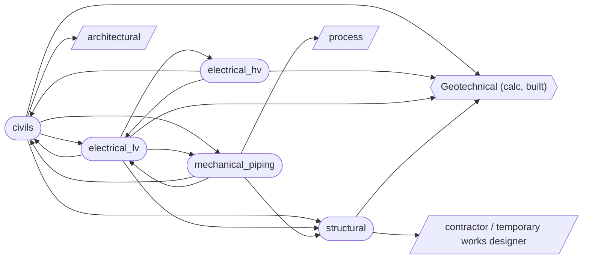

## Process flow — discipline dependency order

Derived directly from the `Interface` entries already declared in each discipline's basis of design (see `integration/graph.py`) — not a separately asserted opinion about sequencing.

**Geotechnical** (the one built calc module) is the one true starting point — civils, structural, and both electrical disciplines all depend on it (ground model, bearing resistance, soil resistivity), and nothing depends back on it.

**Structural** depends only on geotechnical (plus an external contractor for temporary works) and nothing loops back into it from the graph — it can be sequenced right after geotechnical and developed largely independently from there.

**civils, electrical_hv, electrical_lv, mechanical_piping** mutually depend on each other — each one's basis of design references at least one of the others, and following the edges far enough loops back to the start. This is not a strict pipeline: these four disciplines need iterative/concurrent co-design. Use `integration.process_state` to see what's actually unblocked at any point rather than assuming a fixed hand-off order between them.

## Open items / RFI register

53 pending inputs found across all five disciplines' criteria and assumptions (e.g. "to be confirmed from the DNO connection offer") — see `integration/open_items.py`. Full register:

*53 open items across all disciplines.*

### civils (14)

- **Earthworks and ground remediation** [criterion]: Permanent slope angle: to be confirmed from ground model — Set per BS 6031 once characteristic ground parameters are available from calcs/geotechnical/.
- **Foul drainage** [assumption]: Foul flow rates are based on occupancy/use rates per BS EN 752 / Sewers for Adoption guidance, to be confirmed once an occupancy schedule is available.
- **Foul drainage** [assumption]: Connection to the existing public foul sewer is assumed available at adequate capacity — to be confirmed by a sewer capacity check/pre-development enquiry with the water company.
- **Surface water drainage / SuDS** [criterion]: Climate change allowance: to be confirmed against current EA guidance — These published allowances are updated periodically — do not hard-code a percentage without checking the current figure.
- **Surface water drainage / SuDS** [assumption]: Infiltration testing (BRE Digest 365 falling-head test) is assumed required to confirm SuDS feasibility, pending the ground model.
- **Surface water drainage / SuDS** [assumption]: Existing surface water sewer/watercourse is assumed to have available capacity for any residual controlled discharge, pending confirmation.
- **Flood risk** [criterion]: Flood zone classification: to be confirmed from the current EA flood map — Drives whether a full FRA and sequential/exception test are required at all.
- **Flood risk** [assumption]: The site is provisionally assumed Flood Zone 1 (low probability) pending confirmation from the current EA flood map for planning.
- **Highways and access** [criterion]: Design vehicle for swept path: to be confirmed (e.g. articulated HGV, fire tender) — Governs junction/access geometry — set once the site's servicing/emergency access requirements are known.
- **External works and pavements** [criterion]: Design traffic loading: to be confirmed — Set from the actual traffic/servicing regime for the site, per DMRB CD 226.
- **External works and pavements** [assumption]: Subgrade CBR value is assumed from the geotechnical ground model, pending confirmation by in-situ/laboratory CBR testing.
- **Utilities coordination** [criterion]: Minimum service clearance (crossing): to be confirmed per NJUG/street works guidance — Depends on the specific pair of services crossing — no single figure applies across all combinations.
- **Retaining structures** [criterion]: Surcharge loading allowance: to be confirmed — Set from actual adjacent loading (traffic, storage, plant) once the layout is known — do not assume a nominal figure without checking.
- **Retaining structures** [assumption]: Retaining wall type (e.g. gravity, embedded cantilever, propped) is assumed to be determined by height and space constraints, to be confirmed once the layout is finalised.

### structural (4)

- **Substructure and foundations** [criterion]: Minimum founding depth: to be confirmed from ground model — Set from calcs/geotechnical/ characteristic parameters and frost depth once the ground model exists for the site.
- **Substructure and foundations** [criterion]: Base plate bearing pressure limit: to be confirmed — Governed by the concrete/grout bearing capacity beneath the base plate, not the steel design itself.
- **Primary steel frame** [criterion]: Wind loading basis: to be confirmed from BS EN 1991-1-4 site parameters — Standard UK inland site assumed as a default; coastal/exposed/high-altitude sites require a site-specific wind assessment.
- **Temporary works** [criterion]: Permissible unbraced erection stage duration: to be confirmed by contractor — Not a fixed design value — the erection contractor sets this once the erection method statement is developed, informed by the performance requirements in this section.

### electrical_lv (11)

- **Design standards and general criteria** [criterion]: Earthing system: TN-S (provisional) — Typical industrial arrangement fed from a dedicated transformer — the actual system depends on the HV/LV earthing decision made in basis_of_design/electrical_hv.py; confirm once that's settled.
- **Design standards and general criteria** [assumption]: A TN-S earthing system is assumed as the default industrial arrangement, pending confirmation of the combined-vs-separate HV/LV earthing decision (see basis_of_design/electrical_hv.py).
- **Earthing and bonding** [criterion]: Minimum main bonding conductor size: per BS 7671 Table 54.8 — Sized from the supply neutral/earthing conductor cross-sectional area — confirm once the incoming supply arrangement is fixed.
- **Earthing and bonding** [assumption]: Soil resistivity is assumed from calcs/geotechnical/ characteristic values pending confirmation by a direct resistivity test at the earth electrode location(s).
- **Motor control and LV switchgear** [assumption]: Motor loads and quantities are assumed to be confirmed once the mechanical piping discipline's pump/equipment schedule exists — this section cannot finalise MCC sizing independently of that input.
- **Lighting** [assumption]: A standard maintained emergency lighting scheme is assumed (rather than non-maintained/stand-by escape lighting only), pending the site-specific emergency lighting risk assessment.
- **Small power and containment** [assumption]: Cable containment routes are assumed coordinated with mechanical piping and structural steelwork to avoid clashes, pending a 3D model coordination review once all disciplines have routed their services.
- **Hazardous area classification** [criterion]: Equipment protection level (EPL) required: to be confirmed per zone — Set from the zone classification once established — e.g. Ga/Gb/Gc for gas zones.
- **Arc flash and electrical safety** [criterion]: Arc flash study trigger: all boards/MCCs above a minimum prospective fault level (to be confirmed) — Threshold below which an arc flash study is not considered necessary — set per the project's electrical safety policy/client standard.
- **Arc flash and electrical safety** [criterion]: PPE category framework: to be confirmed — IEEE 1584/NFPA 70E or an equivalent UK-recognised method — Sets incident energy bands and corresponding PPE categories once the arc flash study is complete.
- **Arc flash and electrical safety** [assumption]: An arc flash study is assumed required for the main LV switchboard and all MCCs above a minimum fault level threshold, to be confirmed against the project's electrical safety policy.

### electrical_hv (14)

- **Design standards and general criteria** [criterion]: System fault level: to be confirmed from the DNO connection offer/fault level statement — Not calculated independently — obtained from the network operator, since it depends on their upstream network configuration.
- **Design standards and general criteria** [criterion]: Insulation level (BIL): per BS EN 60071, dependent on voltage class — Basic impulse insulation level — set once the HV voltage class is confirmed for the project.
- **Design standards and general criteria** [assumption]: The specific HV voltage class is assumed to be confirmed per project rather than fixed by this basis of design, per the generic-across-voltage-classes scope decision.
- **HV incoming supply and connection** [criterion]: Connection point: to be confirmed via DNO connection application — Set by the DNO's connection offer once submitted — not a value this basis of design can set independently.
- **Substations and switchgear** [criterion]: Switchgear topology: ring main unit (RMU), single incoming supply (provisional) — Typical for a single HV connection — confirm ring/radial topology against the site's actual reliability/redundancy requirement.
- **Substations and switchgear** [criterion]: Substation ingress protection: to be confirmed (indoor building vs. outdoor enclosure) — Set once the substation location/type is fixed with civils/structural.
- **Substations and switchgear** [assumption]: Substation location and space allowance are assumed to be coordinated with civils and structural, pending a confirmed site layout.
- **Transformers** [criterion]: Transformer rating: to be confirmed from the LV load schedule plus diversity — Cannot be finalised independently of basis_of_design/electrical_lv.py's load schedule and diversity assumptions.
- **HV cabling and cable management** [criterion]: Cable insulation/conductor: XLPE insulated, copper or aluminium conductor (to be confirmed) — Conductor material is typically a cost/weight trade-off decision — confirm project preference.
- **HV cabling and cable management** [assumption]: Cable route length/topology is assumed to be coordinated with civils utilities coordination and structural cable management, pending a routing study once the site layout is confirmed.
- **HV earthing and touch/step potential** [criterion]: Touch/step potential limits: per BS EN 50522, based on fault clearance time and body resistance model — No single project-wide figure — calculated from the specific fault clearance time and earthing arrangement once the protection study is complete.
- **HV earthing and touch/step potential** [criterion]: Substation earth resistance target: to be confirmed from soil resistivity survey and earth grid design — Cannot be set without a site-specific soil resistivity survey — see assumptions.
- **Arc flash and HV safety** [criterion]: HV arc flash calculation method: to be confirmed — IEEE 1584 or an equivalent HV-specific method — Confirm which method/tool is used for the incident energy calculation; not all LV-oriented tools extend cleanly to HV switchgear.
- **Arc flash and HV safety** [criterion]: Minimum PPE category for HV switching: to be confirmed from the study — Typically a higher category than the equivalent LV assessment — set once the HV-specific study is complete.

### mechanical_piping (10)

- **Design standards and general criteria** [criterion]: Design pressure: to be confirmed from process data — Set per line from the process design conditions, not a single project-wide figure.
- **Design standards and general criteria** [criterion]: Design temperature: to be confirmed from process data — Set per line from the process design conditions; also drives the minimum design metal temperature (MDMT) check in material_selection_and_corrosion.
- **Design standards and general criteria** [criterion]: Piping class/category: to be confirmed per line (PED Article 13 category / ASME B31.3 fluid service category) — Governs the applicable testing/inspection rigour — kept generic pending the specific process fluid and pressure/volume data per line.
- **Design standards and general criteria** [assumption]: The governing piping code (ASME B31.3 vs. BS EN 13480) is assumed to be confirmed per project/client, consistent with the deliberate decision to keep this generic rather than fix one.
- **Pipe sizing and flow** [criterion]: Maximum allowable pressure drop: to be confirmed per line — Typically constrained by downstream equipment NPSH/control valve authority — set per line, not a single figure.
- **Material selection and corrosion** [criterion]: Minimum design metal temperature (MDMT): to be confirmed — Governs whether impact testing is required per ASME B31.3/BS EN 13480 — set from the lowest expected metal temperature (ambient or process, whichever governs).
- **Pressure testing and inspection** [criterion]: NDT extent: to be confirmed per line class/category — Ranges from spot-check (normal fluid service) to 100% (Category M/severe cyclic service) — set per line once its category is confirmed.
- **Insulation and heat tracing** [criterion]: Heat tracing maintain temperature: to be confirmed per fluid — Set from the specific fluid's freeze point/pour point or viscosity requirement — no single project-wide figure.
- **Supports, structural interface, and hazardous area interface** [criterion]: Coordination review trigger: at each major design stage (to be confirmed per project programme) — Sets how often piping/structural/electrical interface coordination is formally reviewed — confirm against the project's design review schedule.
- **Supports, structural interface, and hazardous area interface** [assumption]: Pipe support loads are assumed final only once the stress analysis (pipe_stress_analysis_and_supports) is complete — iterative coordination with the structural discipline is expected before that point, not a single one-off handover.

